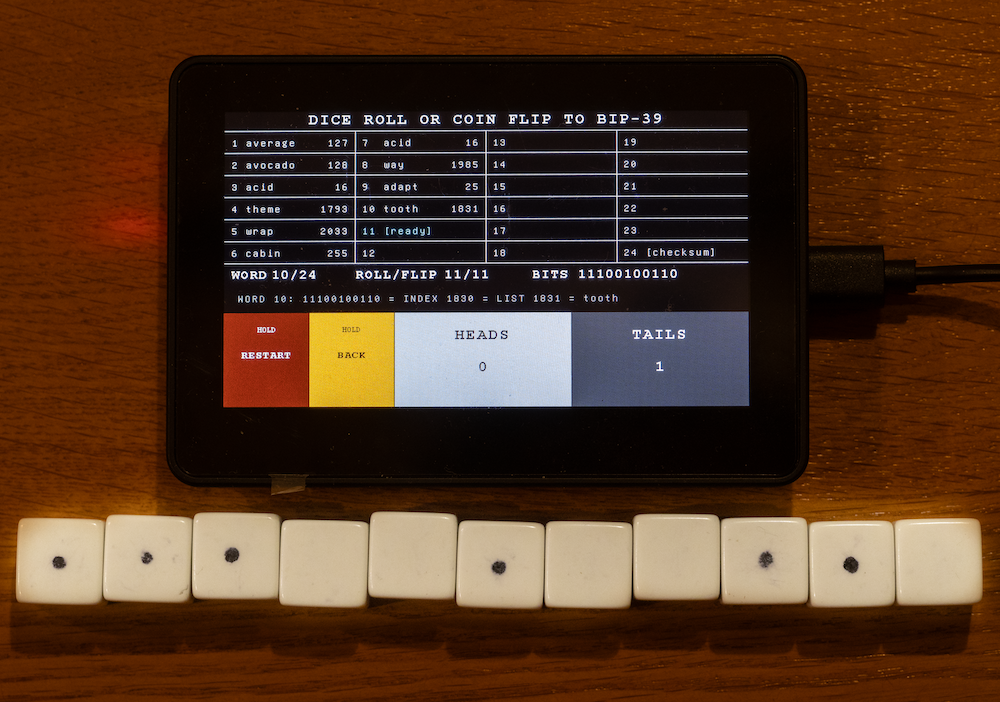
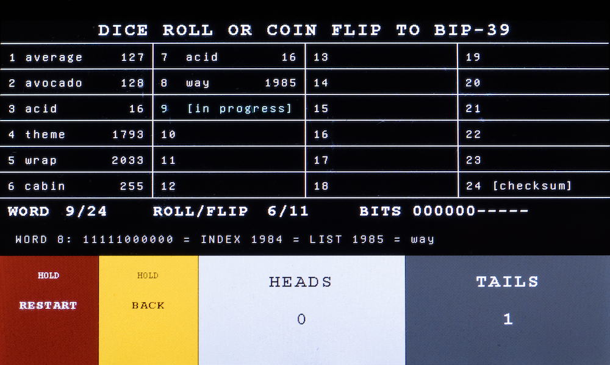

## Dice Roll BIP-39

Dice Roll BIP-39 is an offline, transparent, verifiable, inexpensive and easy to use tool for generating a BIP-39 seed phrase from coin flips or dice rolls.  It runs on either the Waveshare RP2350 4.3-inch Capacitive Touch Display Development Board (RP2350-Touch-LCD-4.3B-BOX) or on the STM32F469I Discovery Development Board (STM32F469I-DISCO).  Both boards use an integrated 4.3 inch touchscreen.  The Waveshare board can be purchased with an optional hard case.  The Waveshare board also has an internal charging circuit that supports a lithium ion battery.  At the time of writing the STM32 board has proven difficult to source and is more expensive.  It has no internal battery charging circuitry.

Dice Roll BIP-39 supports the official BIP-39 wordlists in English, French, Spanish, Italian, Czech and Portuguese.  It can be used to produce either a 12 word or 24 word BIP-39 seed phrase.



BIP-39 specifies a method for generating your wallet's master key pair from a random selection of words from a numbered list of 2048 words, thus creating a seed word phrase.  Lose your wallet and you can regenerate your master keys using your securely backed-up seed phrase.

The master key pair is the most security critical part of your Bitcoin wallet.  So, do you trust the software in your wallet to opaquely generate your seed phrase for you? I’m looking at the bag that my Coldcard hardware wallet came in. On the bag, in bold letters, it says *“DON’T TRUST. VERIFY”*. If you’ve been following the Coldcard fiasco you can see the irony.

Or would you prefer to generate the seed phrase yourself from coin flips or dice rolls, where *you're in control*? Dice Roll BIP-39 facilitates that process, *transparently*.

Flip a coin eleven times to create an eleven bit binary number ranging from 0 to 2047. (Heads is 0, tails is 1.)  Convert that number from binary to decimal to make it easier to read.  Add 1, (because computers count from 0 and people start counting from 1).  Use that number to find the corresponding word in a numbered list of 2048 words.  For a 24 word seed phrase do that 23 times to give you the first 23 words of your seed phrase.  The 24th word contains coin flip results plus a checksum that is calculated from a SHA-256 hash algorithm.

Dice Roll BIP39 does the binary to decimal conversions, seed word list lookups and checksum calculation for you *transparently*.

You can replace coin flips with dice rolls.  A roll of one, two or three gives you a binary 0.  A roll of four, five or six gives you a binary 1.  Or you can use binary dice whose faces are only marked with 0s or 1s.

The easiest method is to roll eleven binary dice together.  Shake them, roll them out, line them up randomly into a row. Tap in their eleven bit values into Dice Roll BIP-39 to produce one seed word.

As an extra security check you can download a BIP-39 wordlist that has both the word's decimal number position and its binary equivalent.  The middle row of Dice Roll BIP-39 displays the seed word's binary number and its position in the list.  Look up the word by its list number and compare the binary number in the list with the binary number on the display.  This independently verifies Dice Roll BIP-39's word list and indexing.

You can find the official BIP-39 word lists [here](https://github.com/bitcoin/bips/blob/master/bip-0039/english.txt).

You can find an English list with the binary numbers included [here](https://github.com/hatgit/BIP39-wordlist-printable-en/blob/master/BIP39-en-printable.txt).

For maximum security, plug the power cable into a 5 V USB wall plug and not the USB port on your computer.

The seed phrase is stored in volatile memory and will be lost when powered down; no sensitive data are stored in permanent memory.  You will need to write down the seed phrase and store it securely.



## Independently verify the source code

You can ask AI to audit the source code from the GitHub repository.  Go to the repository's GitHub release page https://github.com/dgnelsonoz/diceroll-bip39/releases.  Under **Assets** in the latest release, download either of the source code compressed files.  Upload it to your AI chatbot with the following prompt:

```
Audit this GitHub repository's BIP39 mnemonic-generation code.

https://github.com/dgnelsonoz/diceroll-bip39

I'll upload the source code to you.

Trace the code from the user's coin flips or binary dice rolls all
the way to the displayed 12-word or 24-word BIP39 mnemonic.

Verify specifically that:

1. Each set of 11 binary inputs is converted to the intended integer
   in the range 0-2047, with the correct bit order.

2. That integer maps to exactly the corresponding entry in the
   official BIP39 wordlist.

3. For a 12-word mnemonic, the first 11 words encode 121 bits of
   user-provided entropy.

4. The remaining 7 entropy bits are handled correctly.

5. SHA-256 is applied according to BIP39 and the correct 4 checksum
   bits are appended to the 128 bits of entropy.

6. The resulting final 11-bit value selects the correct 12th word.

7. For a 24-word mnemonic, the first 23 words encode 253 bits of
   user-provided entropy.

8. The remaining 3 entropy bits are handled correctly.

9. SHA-256 is applied according to BIP39 and the correct 8 checksum
   bits are appended to the 256 bits of entropy.

10. The resulting final 11-bit value selects the correct 24th word.

11. Every BIP39 wordlist bundled with this repository exactly matches
    the corresponding official BIP39 wordlists, including ordering,
    spelling and number of entries.

12. There is no RNG, PRNG, hardware random-number generator, or other
    source of entropy mixed into or substituted for the user's coin
    flips/dice rolls.

13. Compare both the 12-word and 24-word implementations against
    official BIP39 test vectors where applicable.

Report any discrepancy, even if it appears harmless.

For every conclusion, cite the relevant filename, function and line
numbers in this repository and the corresponding requirement in
BIP39.
```

## Flashing the Waveshare board

Download the Waveshare `.uf2` file for your desired language from the latest GitHub release.  Connect the Waveshare board to your computer with the USB cable.  Put the board into BOOTSEL mode: hold the BOOT button, press and release the RESET button and then release the BOOT button. Drag
`waveshare-<language-version>.uf2` to the mounted `RP2350` drive. 

## Flashing the STM32 board

Download the STM32 `.bin` file for your desired language from the latest GitHub release.  Connect the STM32F469I-DISCO board to your computer using a **USB Mini-B data cable** connected to the **ST-LINK USB connector (CN1)**. Do not use the other USB connector on the board.  Drag
`stm32-<language-version>.bin` to the mounted `DIS_F469NI` drive. 

## Building from source

### Prerequisites

Both boards require
 * [Arm GNU Toolchain](https://developer.arm.com/downloads/-/arm-gnu-toolchain-downloads) (`arm-none-eabi-gcc`)
 * GNU Make
 * Python 3 to build word lists


The Waveshare board requires
 * [Raspberry Pi Pico SDK](https://github.com/raspberrypi/pico-sdk) (Pico SDK 2.2.0 or newer)
 * CMake

The STM32 board requires
 * [STM32CubeF4](https://www.st.com/en/embedded-software/stm32cubef4.html) — V1.28.0 was used during development
 * STM32CubeProgrammer for flashing the board

The repository contains an RP2350 implementation in `waveshare/`, an STM32 implementation in `stm32/` and common code in `common/`.  The two boards can be built independently, they don't have to be built together.

The default external SDK layout is:

```text
your-build-location/
├── diceroll-bip39/
├── STM32CubeF4/
└── pico-sdk/
```

Override SDK locations when necessary:

```bash
make stm CUBE=/path/to/STM32CubeF4
make wave PICO_SDK_PATH=/path/to/pico-sdk
```

## Make command summary

From the project root:

```bash
make generate-wordlists          # Generate all six wordlists
make stm                         # Build all six language specific STM32 ELF and BIN files
make wave                        # Build all six language specific Waveshare UF2 files
make flash-stm                   # Build and flash English STM32 firmware
make flash-wave                  # Build and flash English Waveshare firmware
make flash-stm LANGUAGE=french
make flash-wave LANGUAGE=french  # Flash a selected language, defaults to english
make release VERSION=1.2.0       # Package both platforms in six languages
make test                        # Run tests for both platforms
make audit                       # Audit all variants for flash-write symbols
make clean                       # Remove temporary build files
```